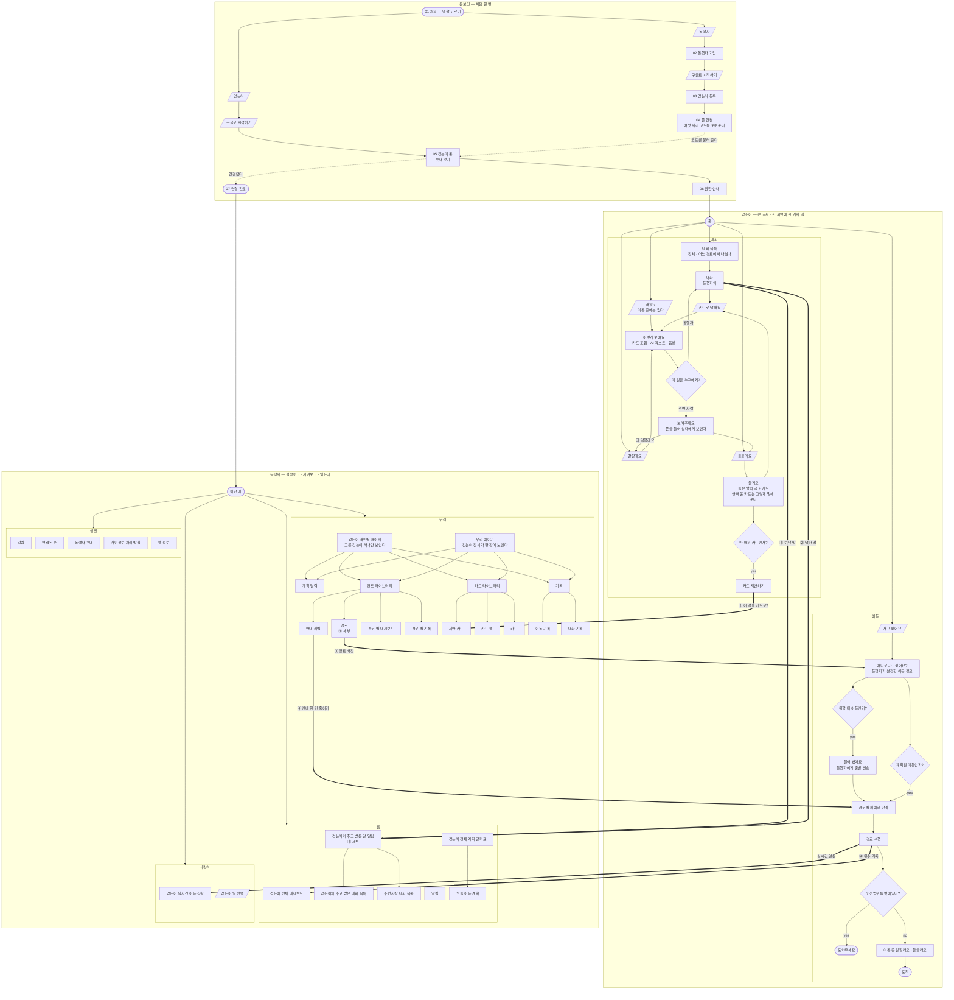
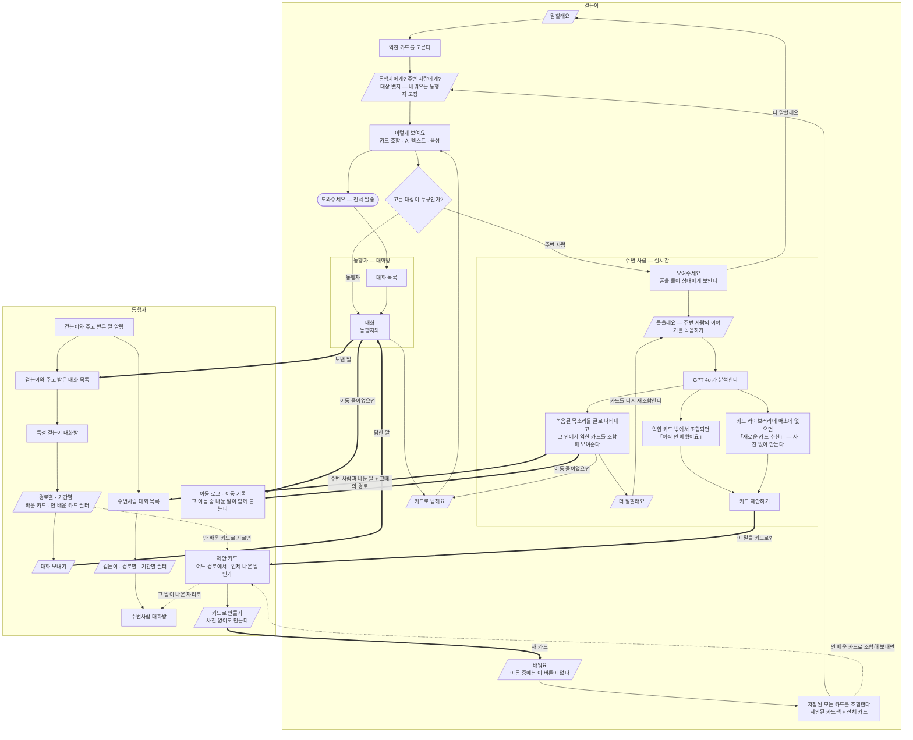
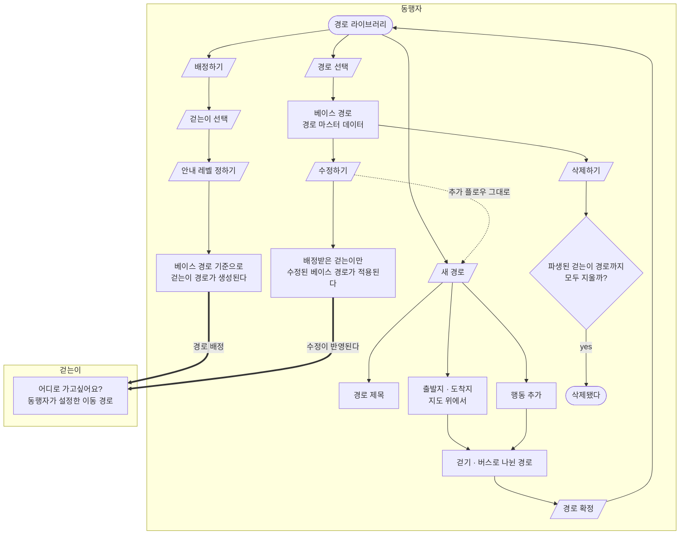
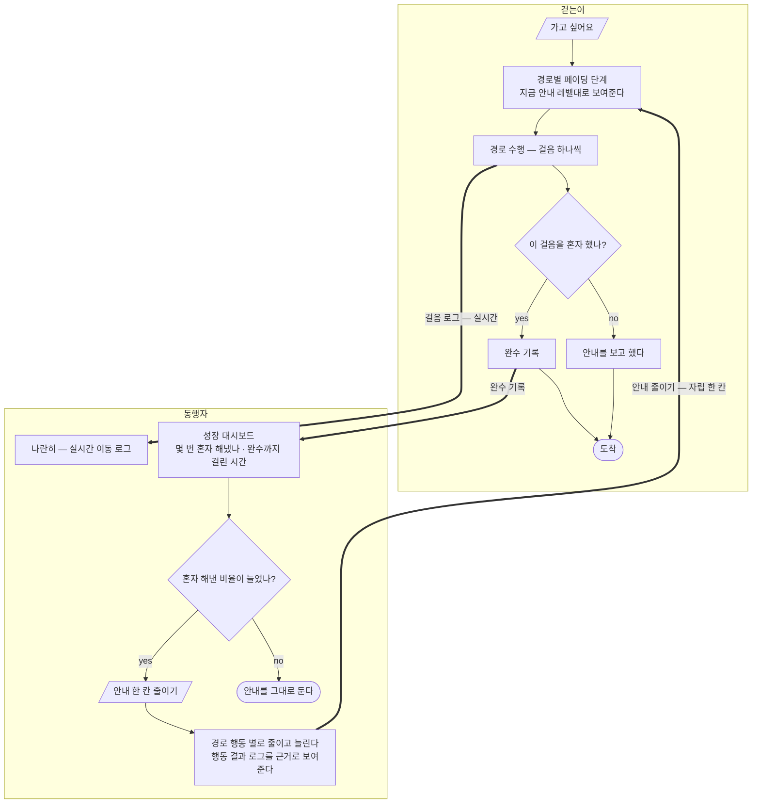

# 전체 흐름 — 걷는이와 동행자

앱은 **하나**입니다. 열면 역할을 고르고, 걷는이와 동행자가 한 가구로 이어집니다.
서버와 데이터가 어떻게 오가는지는 [flowchart-low](flowchart-low.md) 에 있습니다.

| 기호 | 뜻 | | 기호 | 뜻 |
|---|---|---|---|---|
| `⬭` | 흐름의 시작과 끝 | | `◇` | 갈래 |
| `▭` | 화면, 또는 화면이 하는 일 | | **═▶** | 걷는이와 동행자가 **만나는 자리** |
| `▱` | 누르는 것 | | 테두리만 | 묶음 이름 — 화면이 아니다 |

---

## ① 전체 흐름

**세 덩어리입니다** — **온보딩**은 처음 한 번, **걷는이**는 이동과 대화,
**동행자**는 탭 넷으로 지켜봅니다. 깊은 곳은 아래 ②③④ 에서 폈습니다.

### 만나는 자리 — 셋

| | 무엇이 오가나 |
|---|---|
| **대화** | 걷는이가 보낸 말 ↔ 동행자가 답한 말 ↔ 새 카드 |
| **경로 추가 · 배정** | 동행자가 만든 경로 → 걷는이의 갈 곳 |
| **페이딩** | 걷는이의 완수 기록 → 안내가 한 칸 줄어든다 |

---

## ② 대화 — 둘입니다

| | 상대 | 어디서 보나 | 성격 |
|---|---|---|---|
| **현장 대화** | 주변 사람 (가게 · 길) | 보여주세요 → 들을래요 → 볼게요 | 실시간. 폰을 들어 보인다 |
| **대화방** | 동행자 | 대화 목록 → 대화 | 쌓인다. 나중에 읽는다 |

갈리는 자리는 **「이렇게 보여요」** 하나이고, 거기서 **대상이 누구냐**로 나뉩니다.

### 들은 말이 카드로 돌아옵니다

「볼게요」가 **세 줄을 한꺼번에** 냅니다 — 한 문장 안에 익힌 카드와 안 익힌 카드가 섞이기 때문입니다.

| 나온 것 | 화면이 |
|---|---|
| 글 ＋ 그 안의 **익힌 카드** 조합 | 그대로 보여준다 |
| 익힌 카드 **밖에서** 조합된 카드 | 「아직 안 배웠어요」 아래에 띄운다 |
| 카드에 **애초에 없는** 말 | 「새로운 카드 추천」 |

**글은 언제나 뜹니다.** 그리고 **아래 두 줄이 제안 카드로 올라갑니다.**

| | 말할래요 | 배워요 |
|---|---|---|
| 고르는 카드 | 익힌 카드 | **저장된 모든 카드** |
| 보낼 대상 | 동행자 · 주변 사람 | **동행자만** |
| 언제 | 늘 | **이동 중에는 버튼이 없다** |

| 축 | 답하는 물음 | 어디서 |
|---|---|---|
| 상대 | 이 사람과 무슨 말을 했나 | 대화방 |
| 경로 | 이 이동에서 무슨 말이 오갔나 | 이동 로그 |

대화방의 **경로 필터**가 그 둘을 잇습니다 — 지난주 병원 가는 길에 나온 말과
매일 가는 복지관 길에 나온 말은, 같은 낱말이어도 급한 정도가 다릅니다.

---

## ③ 경로 추가 · 배정

| | |
|---|---|
| **베이스 경로** | 동행자가 만든 **원본**. 마스터 데이터 |
| 배정하면 | 그 원본을 기준으로 **걷는이용 사본**이 생긴다 |
| 원본을 고치면 | 그 경로를 **배정받은 걷는이에게** 반영된다 |
| 수정하기 | 새 경로 추가 화면을 **그대로** 탄다 |
| 안내 레벨 | **배정할 때 같이** 정한다 |

---

## ④ 경로를 이행하며 페이딩

**이 그림만 고리입니다.** 혼자 해낼수록 안내가 줄고, 줄어든 안내로 다시 걷습니다.

특수교육에서 **페이딩**이라고 부릅니다. 목표는 매번 잘 안내하는 것이 아니라
**안내가 필요 없어지는 것**입니다.

| 안내 레벨 | 무엇이 보이나 |
|---|---|
| **L1** | 사진 ＋ 글 ＋ 소리 ＋ 확인 |
| **L2** | 사진 ＋ 글 |
| **L3** | 글만 |
| **L4** | 안내 없음 |

| | |
|---|---|
| 매기는 단위 | **걷는이 × 경로의 걸음마다** 따로 |
| 줄이는 조건 | 최근 5회 중 **신호 전 독립 수행 4회 이상** ＋ 같은 구간 **안전오류 0회** |
| 줄이는 주체 | 앱은 **제안**하고, 실제로 바꾸는 것은 **동행자** |
| 안전오류가 나면 | **즉시 되돌린다.** 이것만은 제안이 아니라 실행 |
