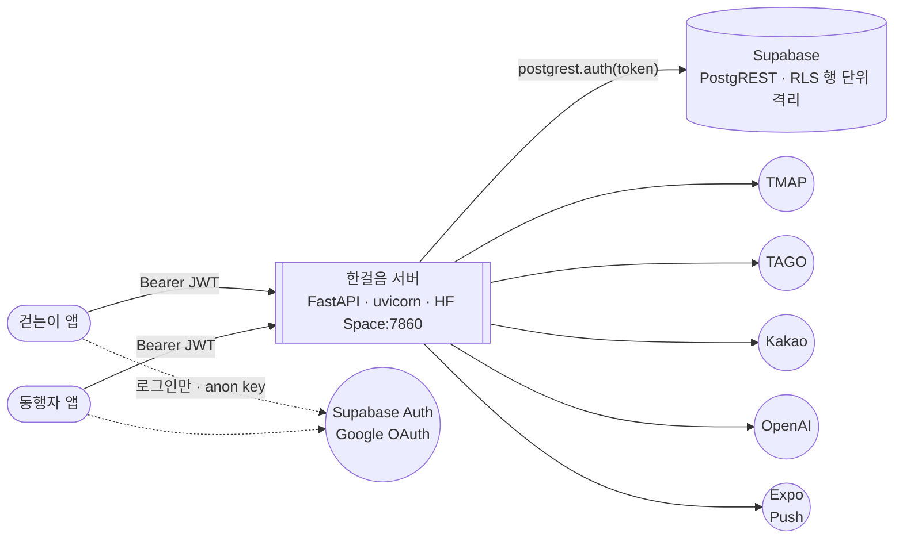
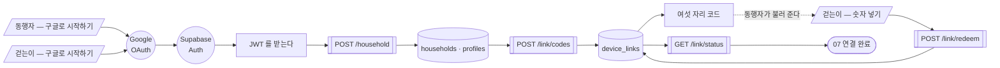
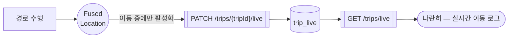
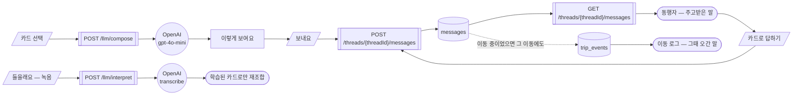
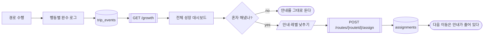
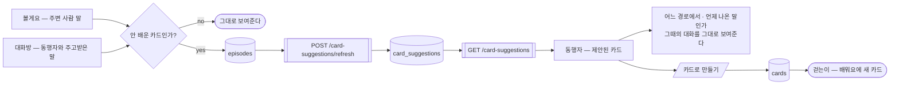
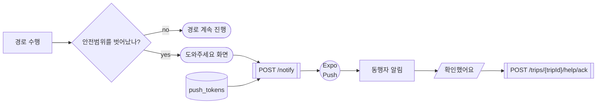

# 로우레벨 — 걷는이와 동행자가 어떻게 이어지는가

> 화면 흐름은 하이레벨(`flowchart`)에 있다. 여기는 **그 둘 사이를 무엇이 나르는가**다.
> 앱은 외부 API 를 직접 치지 않는다. **전부 서버를 지난다.**
>
> 그림마다 밑에 「말 풀이」와 「발표 대사」가 붙어 있습니다. 대사는 그대로 읽으셔도 됩니다.

**도형** ─ 표준 순서도 기호를 쓴다.

| 기호 | 명칭 | 이 차트에서 |
|---|---|---|
| `⬭` | 터미널 | 흐름의 시작과 끝 |
| `▭` | 처리 | 화면 · 서버 안의 계산 |
| `▱` | 입출력 | 사용자가 누르는 것 |
| `◇` | 판단 | 갈래 |
| `⎕` | 미리 정의된 처리 | 한걸음 서버의 엔드포인트 |
| `◯` | 연결자 | 바깥 시스템으로 나가는 입출구 |
| `⛁` | 자기 디스크 | Supabase 의 표 |

## 모든 그림에 나오는 말

| 화면에 보이는 말     | 무슨 뜻인가                                        |
| ------------- | --------------------------------------------- |
| **엔드포인트**     | 서버에 난 **문** 하나. `/routes` 처럼 주소가 곧 문 이름이다     |
| **GET**       | 그 문으로 **읽어 온다**                               |
| **POST**      | 그 문으로 **새로 만든다**                              |
| **PATCH**     | 그 문으로 **일부만 고친다**                             |
| **JWT**       | 로그인하면 받는 **출입증 문자열**. 요청마다 들고 간다              |
| **PostgREST** | 데이터베이스 앞에 선 **문지기**. 표를 주소처럼 열어 준다            |
| **RLS**       | 데이터베이스가 **줄 단위로** 막는 것. 「이 사람은 이 줄만」          |
| **표(테이블)**    | 데이터가 줄로 쌓이는 곳. `trips` · `messages` 처럼 이름이 있다 |

---

## 조감 — 무엇이 무엇과 이야기하는가

**말 풀이**

| 말                         | 무슨 뜻인가                                                                    |
| ------------------------- | ------------------------------------------------------------------------- |
| **FastAPI · uvicorn**     | 파이썬으로 서버를 만드는 도구와, 그것을 돌리는 엔진                                             |
| **HF Space:7860**         | 서버가 사는 자리(Hugging Face)와 **문 번호**                                         |
| **Bearer JWT**            | 「이 출입증을 **지참한** 사람」이라는 뜻. 앱이 요청마다 붙인다                                     |
| **postgrest.auth(token)** | 서버가 그 출입증을 **자기가 쓰지 않고 데이터베이스에 그대로 넘긴다**                                  |
| **anon key**              | 누구나 가질 수 있는 **공개 열쇠**. 이것만으로는 아무 줄도 못 본다                                  |
| **GoTrue**                | Supabase 의 **로그인 담당**. 여기서만 앱이 Supabase 를 직접 만난다                          |
| **Google OAuth**          | 구글 계정으로 로그인하는 길. **계획이다** — 지금 코드는 화면 없이 도는 **익명 로그인**이고, 구글은 아직 안 붙였다 |
| **점선**                    | 데이터가 아니라 **로그인**만 오간다는 뜻                                                  |

**발표 대사**

> 한걸음은 앱 두 개와 서버 하나로 돌아갑니다.
> 걷는이 앱과 동행자 앱은 **TMAP 도, 국토부 버스 데이터도, 카카오 지도도, OpenAI 도 직접 부르지 않습니다.**
> 전부 저희 서버를 거칩니다.
> 이유는 두 가지입니다. 첫째, **그 네 곳의 API 키가 앱 안에 들어가지 않습니다.** APK 는 뜯어볼 수 있으니까요.
> 둘째, 데이터베이스는 **Supabase** 를 쓰는데, Supabase 가 주는 열쇠 둘 중 **`service_role` 키를 안 씁니다.**
> 그걸 쓰면 데이터베이스의 접근 제어가 통째로 꺼지고, **저희가 짠 서버 코드가 유일한 방어선**이 됩니다.
> 대신 로그인한 사람의 출입증을 **Supabase 에 그대로 넘깁니다.**
> 그러면 서버가 「이 사람은 통과」 하고 판단하는 게 아니라, **Supabase 가 직접 줄 단위로 막습니다. 저희 코드가 틀려도요.**
> 발달장애 당사자의 위치와 대화를 다루기 때문에, 인증을 한 겹만 믿지 않았습니다.

---

## 통로는 일곱이다 — 0 번은 처음 한 번뿐이다

| 통로 | 방향 | 무엇이 나르나 |
|---|---|---|
| 0 가구 연결 | 동행자 ↔ 걷는이 | `device_links` |
| 1 경로 배정 | 동행자 → 걷는이 | `assignments` |
| 2 실시간 위치 | 걷는이 → 동행자 | `trip_live` |
| 3 대화 | 양방향 | `messages` |
| 4 완수 로그와 자립 | 걷는이 → 동행자 → 걷는이 | `trip_events` → `assignments` |
| 5 카드 제안 | 걷는이 → 동행자 → 걷는이 | `episodes` → `card_suggestions` |
| 6 도와주세요 | 걷는이 → 동행자 | Expo Push |

---

## 0. 가구 연결 — 두 폰이 하나로 묶인다

**말 풀이**

| 말 | 무슨 뜻인가 |
|---|---|
| **OAuth** | 비밀번호를 **우리에게 주지 않고** 구글이 대신 「이 사람 맞다」고 보증하는 방식 |
| **JWT 를 받는다** | 로그인이 끝나면 **출입증 문자열**이 하나 생긴다. 이때부터 그걸 들고 다닌다 |
| **households · profiles** | 가구 하나와 그 안의 사람들이 적히는 표 |
| **device_links** | 「이 폰과 저 폰이 한 가구다」가 적히는 표. 여섯 자리 코드도 여기 산다 |
| **redeem** | 코드를 **쓴다**는 뜻. 한 번 쓰면 죽는다 |
| **구글로 시작하기** | **계획이다.** 지금은 앱이 켜질 때 **화면 없이** 익명 로그인이 돈다 |

**발표 대사**

> 두 폰을 묶는 과정입니다. 이건 처음 한 번만 합니다.
> 동행자가 구글 계정으로 로그인하고 **가구를 만듭니다.** 그러면 **여섯 자리 코드**가 나옵니다.
> 걷는이 폰에 그 숫자만 넣으면 끝입니다. 한 번 쓴 코드는 바로 죽습니다.
> 왜 코드냐면 — 걷는이에게 **아이디와 비밀번호를 입력하게 할 수 없기 때문**입니다.
> 저희 첫 사용자는 발달장애 당사자입니다. 숫자 여섯 개가 저희가 찾은 제일 짧은 길이었습니다.
> 로그인은 구글에 맡깁니다. **비밀번호를 저희가 받지 않으면, 저희가 흘릴 일도 없습니다.**

---

## 1. 경로 배정 — 동행자가 만들고 걷는이가 받는다

```mermaid
%%{init:{"flowchart":{"nodeSpacing":24,"rankSpacing":50,"curve":"basis"}}}%%
flowchart LR
  A1[/"새 경로"/] --> A2["출발지 · 도착지"]
  A2 --> AQ{"내 위치로 골랐는가?"}
  AQ -->|yes| A3[["GET /geocode/address"]] --> X1((Kakao))
  AQ -->|no| A4[["GET /map"]] --> X2(("Kakao<br/>JS SDK"))
  X1 --> A5["주소가 채워진다"]
  X2 --> A5
  A5 --> A6[["POST /routes/plan"]]
  A6 --> X3((TMAP)) --> A7["걷기 · 버스로 나뉜 경로"]
  A6 --> X4((TAGO)) --> A7
  A7 --> A8[/"경로 확정"/] --> A9[["POST /routes"]] --> D1[("routes · route_steps")]
  D1 --> A14[/"경로 선택 → 수정하기"/]
  A14 -.->|"추가 플로우 그대로"| A1
  A14 --> A15[["PATCH /routes/{routeId}"]] --> D1
  D1 --> A10[/"배정하기"/]
  A10 --> A11[["POST /routes/{routeId}/assign"]] -->|"independenceLevel"| D2[("assignments")]
  D2 --> A12[["GET /routes"]] --> A13(["걷는이 — 갈 곳 목록"])
```

**말 풀이**

| 말 | 무슨 뜻인가 |
|---|---|
| **Kakao** | 지도와 **주소**를 담당. 좌표를 주소로 바꿔 준다 |
| **GET /map** | 지도 화면을 **서버가 만들어서 내려 준다.** 지도 키가 앱에 안 들어가게 하려고 그렇게 했다 |
| **TMAP** | **걸어가는 길**을 찾아 주는 곳 |
| **TAGO** | 국토교통부의 **버스 공공데이터** |
| **POST /routes/plan** | 「이 출발지에서 저 도착지까지 **어떻게 가나**」를 서버가 계산하는 문 |
| **route_steps** | 경로를 **걸음 하나씩** 쪼개서 담은 표 |
| **independenceLevel** | **자립 단계 숫자.** 안내를 얼마나 보여줄지를 이 값이 정한다 |
| **assignments** | 「이 경로를 이 걷는이에게 준다」가 적히는 표 |
| **점선 ⟲** | **수정하기를 누르면 새 경로 만드는 화면을 그대로 탄다** |

**발표 대사**

> 동행자가 경로를 만드는 과정입니다.
> 출발지와 도착지를 지도에서 찍으면, 서버가 **TMAP 으로 걷는 길을, 국토부 버스 데이터로 버스 구간을** 받아
> 하나의 경로로 합칩니다. 그걸 **걸음 하나씩** 쪼개서 저장합니다.
> 여기서 중요한 건 **베이스 경로라는 개념**입니다. 동행자가 만든 경로는 **원본**이고,
> 걷는이에게 줄 때 그 원본을 기준으로 **걷는이용 사본**이 생깁니다.
> 그래서 원본을 고치면 **그 경로를 배정받은 걷는이에게만** 반영됩니다.
> 배정할 때 **자립 단계**를 같이 정합니다. 이 숫자 하나가 걷는이 화면에서 **안내를 얼마나 보여줄지**를 결정합니다.

---

## 2. 실시간 위치 — 걷는이가 걸으면 동행자가 본다

**말 풀이**

| 말 | 무슨 뜻인가 |
|---|---|
| **FusedLocation** | 안드로이드가 **GPS · 와이파이 · 기지국**을 합쳐서 위치를 주는 장치. 혼자 GPS 만 쓰는 것보다 정확하고 배터리를 덜 먹는다 |
| **이동 중에만 활성화** | 걷는이가 **경로를 수행하는 동안에만** 켠다. 평소에는 위치를 안 본다 |
| **trip_live** | **지금 어디 있나**가 덮어써지는 표. 이동 하나에 줄 하나다 |
| **PATCH** | 이미 있는 줄을 **덮어쓴다**는 뜻. 그래서 위치 기록이 쌓이지 않는다 |

**발표 대사**

> 걷는이가 이동을 시작하면 그때부터 위치가 동행자에게 갑니다.
> 위치는 **이동 중에만** 켭니다. 평소에는 아예 보지 않습니다.
> 그리고 **덮어쓰기**로 저장합니다. 지금 어디 있는지 한 줄만 남고, **이동 경로가 통째로 쌓이지 않습니다.**
> 보호자에게 필요한 건 「지금 어디」지 「어제 몇 시에 어디」가 아니라고 봤습니다.
> 이 표는 앱이 직접 쓸 수 없습니다. **Supabase 의 RLS** 가 자기 줄만 쓰도록 막아 뒀습니다.

`trip_live` 는 RLS `with check` 가 걸려 있어 **앱이 직접 쓸 수 없다.** 서버가 걷는이의 JWT 를
PostgREST 에 넘겨 자기 행만 쓰게 한다.

---

## 3. 대화 — 카드가 문장이 되어 오간다

**말 풀이**

| 말 | 무슨 뜻인가 |
|---|---|
| **gpt-4o-mini** | OpenAI 의 **작고 빠른** 모델. 카드 몇 장을 **한 문장으로** 엮는 데 쓴다 |
| **transcribe** | **말소리를 글자로** 바꾸는 것 |
| **compose** | 짓는다 — 걷는이가 고른 카드 → 문장 |
| **interpret** | 알아듣는다 — 상대방 말 → 걷는이가 **아는 카드로** 다시 조합 |
| **threads / messages** | 대화방과 그 안의 말들이 쌓이는 표 |
| **「학습된 카드로만 재조합」** | 걷는이가 **배운 적 없는 말은 안 쓴다.** 모르는 말로 설명하면 못 알아듣기 때문 |

**발표 대사**

> 걷는이는 글을 쓰는 대신 **카드를 고릅니다.**
> 「화장실」 「어디」 같은 카드 두세 장을 고르면, **OpenAI 의 `gpt-4o-mini`** 가 **「화장실이 어디예요?」**로 엮습니다.
> 중요한 건 반대 방향입니다. 상대방이 한 말을 **그대로 보여주지 않습니다.**
> 말소리를 글자로 바꾼 다음, **걷는이가 이미 배운 카드들로 다시 조합해서** 보여줍니다.
> 모르는 단어로 설명하면 못 알아듣기 때문입니다.
> 그래서 같은 말이라도 **걷는이마다 다르게 보입니다.** 그 사람이 아는 만큼만 보여주는 겁니다.
> 그리고 **이동 중에 나눈 말은 그 이동의 로그에도 같이 남습니다.** 나중에 「그날 병원 가는 길에
> 무슨 일이 있었나」를 볼 때, 어디서 멈췄는지와 **무슨 말을 했는지가 한 화면에** 있습니다.

---

## 4. 완수 로그와 자립 — 혼자 해내면 안내가 줄어든다

**말 풀이**

| 말 | 무슨 뜻인가 |
|---|---|
| **trip_events** | 이동 중에 **무슨 행동을 했는지**가 하나씩 쌓이는 표. 덮어쓰지 않고 **모은다** |
| **GET /growth** | 그 쌓인 것을 **얼마나 늘었나**로 계산해서 내려 주는 문 |
| **페이딩(fading)** | 특수교육 용어. **도움을 조금씩 걷어내는 것**. 이 앱의 핵심 개념이다 |
| **안내 레벨** | 그 걷어냄의 **단계**. 앞의 `independenceLevel` 과 같은 값이다 |

**발표 대사**

> 이 부분이 저희 앱이 다른 길찾기 앱과 갈리는 자리입니다.
> 저희 목표는 **매번 잘 안내하는 것이 아니라, 안내가 필요 없어지는 것**입니다.
> 특수교육에서는 이걸 **페이딩**이라고 합니다. 도움을 조금씩 걷어내는 거죠.
> 걷는이가 이동할 때마다 **어떤 행동을 스스로 했는지**가 쌓입니다.
> 동행자는 그걸 대시보드에서 보고, 혼자 해내는 게 보이면 **안내 레벨을 한 칸 낮춥니다.**
> 그러면 **다음 이동부터 화면에 나오는 안내가 실제로 줄어듭니다.**
> 잘 만든 앱이라면, 언젠가 이 앱을 안 켜게 되는 게 맞다고 생각합니다.

---

## 5. 카드 제안 — 안 배운 말이 새 카드가 된다

**말 풀이**

| 말 | 무슨 뜻인가 |
|---|---|
| **episodes** | 「이런 대화가 있었다」가 한 덩이로 쌓이는 표 |
| **refresh** | 쌓인 에피소드를 **다시 훑어서** 제안 목록을 새로 짓는다는 뜻 |
| **card_suggestions** | 「이 말은 카드로 만들 만하다」가 담기는 표 |
| **「어느 경로에서 · 언제」** | 제안만 던지지 않고 **그 말이 나온 실제 대화**를 같이 보여준다. 같은 낱말이어도 **병원 가는 길에서 나온 말과 늘 가는 길에서 나온 말은 급한 정도가 다르다** |

**발표 대사**

> 걷는이가 모르는 말을 만나면 그걸로 끝나지 않습니다.
> 주변 사람과 나눈 말이든, **동행자와 주고받은 말이든** 똑같습니다.
> 앱이 **그 상황을 기억해 뒀다가** 동행자에게 「이 말을 카드로 만드시겠어요?」 하고 제안합니다.
> 그냥 단어만 던지지 않습니다. **그 말이 나왔던 실제 대화를, 어느 경로에서 언제 나왔는지와 함께 보여줍니다.**
> 「지난주 병원 가는 길에 이런 말이 나왔어요」 하고요.
> 같은 낱말이어도 **병원 길에서 나온 말과 매일 가는 길에서 나온 말은 급한 정도가 다릅니다.**
> 그래야 동행자가 **지금 이 아이에게 필요한 말인지** 판단할 수 있습니다.
> 동행자가 만들어 주면 걷는이의 「배워요」에 새 카드로 들어갑니다.
> **쓸수록 말이 늘어나는 구조**입니다.

---

## 6. 도와주세요 — 안전범위를 벗어나면 알림이 간다

**말 풀이**

| 말 | 무슨 뜻인가 |
|---|---|
| **Expo Push** | 앱이 꺼져 있어도 **폰 알림을 띄우는 길** |
| **push_tokens** | 「이 사람의 폰은 이 주소로 알림을 받는다」가 담긴 표 |
| **안전범위** | 경로에서 **얼마나 벗어나면 이상한가**의 경계. 경로를 따라 띠처럼 그려진다 |
| **ack (acknowledge)** | **「봤다」는 응답.** 동행자가 확인했다는 것이 걷는이 화면에도 뜬다 |

**발표 대사**

> 걷는이가 경로에서 벗어나면 앱이 먼저 알아챕니다.
> 걷는이 화면에는 **「도와주세요」** 한 칸만 크게 뜹니다. 그 순간에 여러 개를 고르게 하면 안 되니까요.
> 동시에 동행자 폰에 알림이 갑니다. 앱이 꺼져 있어도 뜹니다.
> 동행자가 확인을 누르면 **그게 걷는이 화면에도 표시됩니다.**
> **「보호자가 알고 있다」**는 걸 걷는이가 아는 게 중요하다고 봤습니다.
> 혼자 기다리는 것과, 누가 오고 있다는 걸 아는 채로 기다리는 건 다르니까요.
